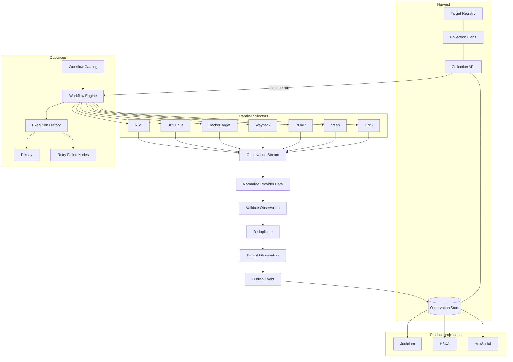

# Collection Platform Architecture

**Status:** Frozen reference (v1 complete, 2026-07-10). Phase 2 is operational hardening — connector health, NOC metrics, and observation explorer.

See also: [COLLECTION-PLATFORM.md](./COLLECTION-PLATFORM.md) (API, CLI, migration notes).

**Dashboard:** [Cascades Architecture](/dashboard/architecture) (`http://127.0.0.1:3102/dashboard/architecture`)

---

## System diagram (frozen)



### Layer responsibilities

| Layer | Owns | Does not own |
|-------|------|--------------|
| **Harvest** | Target registry, collection plans (templates + schedules), observation store, collection step APIs, events | Workflow orchestration, connector parallelism, DAG execution |
| **Cascades** | Workflow catalog, engine, execution history, replay, retry failed nodes | Long-term observation storage, product-specific projection |
| **Connectors** | Provider fetch (DNS, crt.sh, RDAP, …) | Direct persist; always via Harvest step APIs |
| **Products** | Case linkage, dashboards, alerts | Collection execution |

### Implementation note (v1)

The logical pipeline above is **Normalize → Validate → Deduplicate → Persist → Publish Event**. In v1 these steps run **inside the Cascades `persist_observation_stream` node** in batches (default 500 findings per batch) to avoid oversized HTTP payloads. The diagram is the contract; the stream node is the current packaging.

Merge happens in Cascades memory before the stream (`merge-findings` JavaScript node). `finalize_collection` closes the run and updates target registry state.

---

## Data flow (one collection)

```
1. Cron / CLI → Harvest enqueues due targets
2. Harvest POST /api/workflows/{template}/run → Cascades
3. Cascades: resolve target → parallel harvest_connector nodes
4. Merge findings → Observation Stream (batched normalize/validate/dedupe/persist)
5. Finalize → collection_events + last_cascades_run_id
6. Observations in osint_harvest_findings (STIX + PROV + workflow_run_id, node_id, connector_id)
7. Products query Observation Store on demand
```

There is **no** second in-process pipeline. Legacy direct connector orchestration is retired.

---

## Unified Observation model (Phase 2 direction)

Stop thinking in terms of opaque "connector outputs." **Everything becomes an Observation** — queryable, linkable, and cross-referenced.

| Source | Observation type | Example |
|--------|------------------|---------|
| Provider fetch | Domain / DNS / cert finding | `example.com` A record from DNS |
| Connector health | `connector.health` | crt.sh → `rate_limited` |
| Connector runtime | `connector.event` | HackerTarget quota exceeded |
| Workflow engine | `workflow.event` | Passive Domain Collection → `completed_with_warnings` |
| Platform | `collection.event` | Already in `collection_events`; converge on observation shape |

Health states per connector:

| State | Meaning |
|-------|---------|
| `healthy` | Recent success, within SLO |
| `warning` | Elevated latency or intermittent errors |
| `offline` | Provider unreachable |
| `rate_limited` | Quota / 429 / membership limit |
| `authentication_failed` | Auth or entitlement failure |
| `disabled` | Operator or policy disabled |

Each state transition and connector call summary should be persistable as an observation with provenance (`workflow_run_id`, `connector_id`, `node_id`).

---

## Phase 2: make the platform operational

Make what exists operable like a production NOC while continuing to extend connectors and workflows.

### 1. Connector health

Every connector gets live status + historical uptime:

- Current state (healthy / warning / offline / rate_limited / authentication_failed / disabled)
- Rolling success rate, last success, last failure reason
- Derived from task runs, `collection.connector.*` events, and health observations

### 2. Provider dashboard

Pivot from targets-first to **providers-first**. One row per connector:

| Provider | Last run | Avg duration | Failures (24h) | Rate limit hits | Last success |
|----------|----------|--------------|----------------|-----------------|--------------|
| crt.sh | … | … | … | … | … |
| dns | … | … | … | … | … |
| rdap | … | … | … | … | … |
| … | | | | | |

### 3. Collection metrics (NOC view)

Single Harvest admin page — today's platform pulse:

- Collections run / succeeded / failed
- Targets processed
- Connector calls (total, by provider)
- Observations: inserted / duplicates skipped / validation skipped
- Failures by category
- Average runtime (collection + workflow)

### 4. Workflow analytics

Per workflow template (e.g. `passive-domain-collection`):

- Executions (count, trend)
- Average runtime
- Failure rate
- Average observations per run
- Connector contribution breakdown

Use this to optimize workflows before adding complexity.

### 5. Observation explorer (Harvest killer feature)

Search-first UI:

```
example.com → Collected | Connector | Workflow | Run | Time | Confidence
```

Click a row → deep link to Cascades run (`/dashboard/workflow/{template}?runId=…`) and Harvest finding detail.

Requires consistent `workflow_run_id`, `connector_id`, `node_id` on every observation (already on v1 findings).

---

## Cascades operations (shipped in v1)

| Capability | API / UI |
|------------|----------|
| Full replay | `POST /api/runs/:runId/replay` |
| Partial retry | `POST /api/runs/:runId/retry-failed` — seeds successful nodes, re-runs failed connectors + downstream only |
| Visual run tree | Cascades workflow dashboard + `collection-run-view.js` |
| Batched persist | `persist_observation_stream`, runtime batch size via `GET/PATCH /api/collection/config` |

---

## Future (think, do not implement yet)

### Event bus

Today:

```
Persist → Done
```

Eventually:

```
Persist → Observation Created → Subscribers
                              ├─ Judicium (case sync)
                              ├─ H3XA (cyber graph)
                              ├─ HexSocial (brand monitor)
                              ├─ Alerting
                              └─ Analytics pipeline
```

Observations become the canonical event payload. `collection_events` and product webhooks converge on a single **Observation Created** contract (STIX object + PROV + execution linkage).

Design constraints for when this ships:

- At-least-once delivery with idempotent subscribers (`content_hash` / observation id)
- Subscribers must not block persist path
- Replay and retry-failed must not double-notify without dedupe keys

---

## Phase checklist

| Phase | Focus | Status |
|-------|-------|--------|
| **v1** | Cascades-mandatory path, batched stream, replay, retry failed nodes, 13-target migration | Complete |
| **Phase 2** | Connector health, provider dashboard, NOC metrics, workflow analytics, observation explorer, unified observation types | Planned |
| **Future** | Event bus, subscriber registry, cross-product streaming | Design only |
