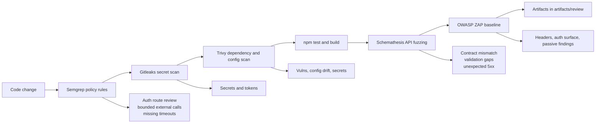

# Security Review Flow

This repo now has a staged review path that makes the code movement visible from change to runtime checks.

## Visual flow



## What to run

Local baseline:

```bash
npm run review:security
```

The `npm` entrypoint uses PowerShell so it works in this Windows workspace. The existing `scripts/review/security-review.sh` remains available for Linux CI or shell users.

Dynamic API review against a running instance:

```bash
export SCHEMATHESIS_BASE_URL=http://127.0.0.1:3020
export ZAP_TARGET_URL=http://127.0.0.1:3020
npm run review:security
```

PowerShell equivalent:

```powershell
$env:SCHEMATHESIS_BASE_URL = 'http://127.0.0.1:3020'
$env:ZAP_TARGET_URL = 'http://127.0.0.1:3020'
npm run review:security
```

## Outputs

Artifacts are written to `artifacts/review/`:

- `npm-test.txt`
- `npm-build.txt`
- `semgrep.json`
- `gitleaks.json`
- `trivy.txt`
- `schemathesis-junit.xml`
- `zap-report.html`
- `zap-report.md`

## Repo-specific intent

- `Semgrep` is tuned to flag new privileged `/api/platform/v1/*` POST routes for manual auth review.
- `OpenAPI` is intentionally minimal and centered on the new v1 RPC surface.
- `Schemathesis` and `ZAP` are optional because this app may require auth, env, and data sources in different environments.
- `artifacts/review/` is ignored so the reports stay local or CI-only.
